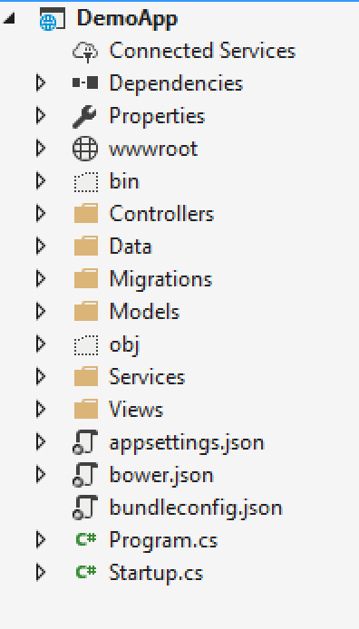
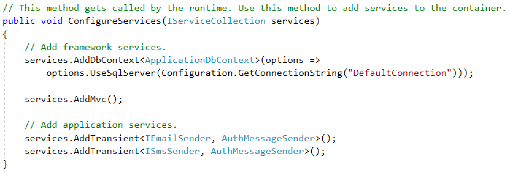
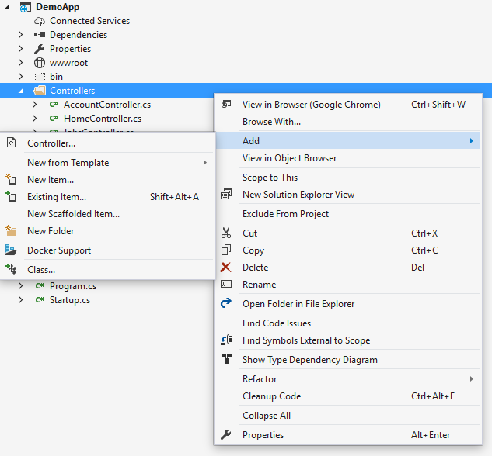
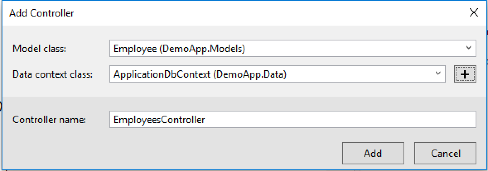
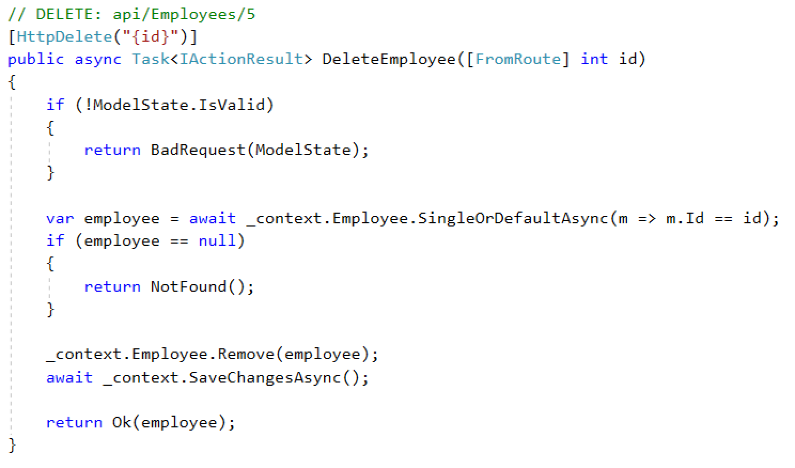

### An <span style="color: #e49436">Opinionated</span> and <span style="color: #e49436">Maintainable</span> REST API Architecture for <span class="orange">ASP.NET Core</span>

#####  Spencer Schneidenbach

[@schneidenbach](https://twitter.com/schneidenbach)  

---

Twitter [@schneidenbach](https://twitter.com/schneidenbach)  

## Slides plus more at

rest.schneids.net

---

## <span class="orange">Setting the stage</span>

"We need a new SPA"  
"We need a new REST API"

---

## <span class="orange">ASP.NET Core</span>

###### (or "old" ASP.NET MVC/Web API)

---

## Zero to <span class="orange">"make magic happen"</span>

---

Scaffolding

---

The promise
## Scaffolding is <span class="orange">amazing</span>

Productivity! Awesomeness!

---

## Let's take a tour

---

## Introducing the Employee

```csharp
public class Employee
{
    public int Id { get; set; }
    [Required]
    public string FirstName { get; set; }
    [Required]
    public string LastName { get; set; }
    public DateTime DateOfBirth { get; set; }
    public DateTime DateOfHire { get; set; }
    public string SocialSecurityNumber { get; set; }
}
```

---

## The Employee Object

* Is part of payroll software
* Contains sensitive data (SSN)

---

## You, the Developer(tm)

* Loves Visual Studio tooling
* Loves to get stuff done

---

## ASP.NET Core + Entity Framework Core

###### (or ASP.NET Web API + EF6)
###### (or ASP.NET Web API + a database)
###### (or ASP.NET Web API + whatever)

---

## File -> New Project



---

## <span class="orange">Startup.cs</span>



---


---



---


---



---

### A wild <span class="orange">EmployeeController</span> appeared

---


---


---


---


---


---


---



---

The promise
## Scaffolding is <span class="orange">amazing</span>

Productivity! Awesomeness!

---

The reality
## Scaffolding is a <span class="orange">lie</span>

---

## <span class="orange">Controller</span> is a one man army
Route the request  
Validate  
Run service for request  
Return data

---

## No <span class="orange">separation of concerns</span>

---

## Controller should <span class="orange">only</span>
Route the request  
Return data

---

## Entity is also <span class="orange">request</span>

---

```csharp
public class Employee
{
    public int Id { get; set; }
    [Required]
    public string FirstName { get; set; }
    [Required]
    public string LastName { get; set; }
    public DateTime DateOfBirth { get; set; }
    public DateTime DateOfHire { get; set; }
    public string SocialSecurityNumber { get; set; }
}
```

---

So let's break it apart

---

## <span class="orange">CQRS</span>  
Command Query Responsibility Segregation

---

## <span class="orange">Bottom line</span> - move:
- Validation
- Running service
- Requests  
somewhere else

---

## <span class="orange">Why?</span>
- Reusability
- Separation of concerns
- Easier testing

---

Let's start with the request

---

```csharp
public class Employee
{
    public int Id { get; set; }
    [Required]
    public string FirstName { get; set; }
    [Required]
    public string LastName { get; set; }
    public DateTime DateOfBirth { get; set; }
    public DateTime DateOfHire { get; set; }
    public string SocialSecurityNumber { get; set; }
}
```
---

Problem?
### <span class="orange">Entity</span> being used for <span class="orange">requests</span>
### <span class="orange">Model/model validation</span> are not <span class="orange">separate</span>

---

### Rule 1: separate <span class="orange">entity</span> from <span class="orange">model</span>
So let's refactor

---

```csharp
public class Employee
{
    public int Id { get; set; }
    [Required]
    public string FirstName { get; set; }
    [Required]
    public string LastName { get; set; }
    public DateTime DateOfBirth { get; set; }
    public DateTime DateOfHire { get; set; }
    public string SocialSecurityNumber { get; set; }
}
```

---

## <span class="orange">Business rule</span>
Can create Employee with SocialSecurityNumber but not update

---

## Create (POST)

```csharp
public class EmployeeCreateRequest
{
    [Required]
    public string FirstName { get; set; }
    [Required]
    public string LastName { get; set; }
    public DateTime DateOfBirth { get; set; }
    public DateTime DateOfHire { get; set; }
    public string SocialSecurityNumber { get; set; }
}
```

---

## Update (PUT)

```csharp
public class EmployeeUpdateRequest
{
    [Required]
    public string FirstName { get; set; }
    [Required]
    public string LastName { get; set; }
    public DateTime DateOfBirth { get; set; }
    public DateTime DateOfHire { get; set; }
}
```

---

## Delete (DELETE)

```csharp
public class EmployeeDeleteRequest
{
    public int Id { get; set; }
}
```

---

## <span class="orange">Clunky</span> to validate  
(especially outside of ASP.NET)

---


[source](http://stackoverflow.com/questions/3400542/how-do-i-use-ivalidatableobject)

---

### Rule 2: separate <span class="orange">validation</span> from <span class="orange">model</span>

### Introducing <span class="orange">Fluent Validation</span>

---

## <span class="orange">Fluent Validation</span>

---

```csharp
public class EmployeeRequest
{
    [Required]
    public string FirstName { get; set; }
    [Required]
    public string LastName { get; set; }
}
```

---

## <span class="orange">Isolate</span> validation functionality

---

```csharp
public class EmployeeCreateValidator : AbstractValidator<EmployeeCreateRequest>
{
    public EmployeeValidator()
    {
        RuleFor(e => e.FirstName).NotEmpty()
                .WithMessage("First name is required.")
        RuleFor(e => e.LastName).NotEmpty()
                .WithMessage("Last name is required.")
    }
}
```

---

```csharp
public class EmployeeCreateValidator : AbstractValidator<EmployeeCreateRequest>
{
    public EmployeeValidator()
    {
        RuleFor(e => e.FirstName).NotEmpty()
                .WithMessage("First name is required.")
        RuleFor(e => e.LastName).NotEmpty()
                .WithMessage("Last name is required.")
    }
}
```

```csharp
public class EmployeeCreateRequest
{
    public string FirstName { get; set; }
    public string LastName { get; set; }
}
```

---

## Then you can <span class="orange">test</span> independently

```csharp
[Test]
public void EmployeeNameIsRequired()
{
    var request = new EmployeeCreateRequest();  //no props
    var validator = new EmployeeCreateValidator();

    var result = validator.Validate(request);
    var firstNameMissing = result.Any(r => r.PropertyName == "FirstName");
    var lastNameMissing = result.Any(r => r.PropertyName == "LastName");
    
    Assert.That(firstNameMissing, Is.EqualTo(true));
    Assert.That(lastNameMissing, Is.EqualTo(true));
}
```

---

## Tests can also have dependencies

```csharp
public class EmployeeDeleteValidator : AbstractValidator<EmployeeDeleteRequest>
{
    public ApplicationDbContext Context { get; }
    public EmployeeValidator(ApplicationDbContext context)
    {
        Context = context;
        RuleFor(e => e.Id).Must(ExistInDatabase)
                .WithMessage("ID does not exist.")
    }

    public void ExistInDatabase(EmployeeDeleteRequest request) {
        return Context.Employee.Find(request.Id) != null;
    }
}
```

---

## What we've accomplished
- Separated request model from entity
- Separated validation from request model

---

## Next: Extracting <span class="orange">services</span>

---


---

### Rule 3: separate <span class="orange">request handler</span> from <span class="orange">controller</span>

## Introducing <span class="orange">MediatR</span>

---

## <span class="orange">MediatR</span>
* Requests
* Handlers

---

```csharp
public class EmployeeCreateRequest : IRequest<int>
{
    public string FirstName { get; set; }
    public string LastName { get; set; }
}
```

@[1]

---

```csharp
public class EmployeeCreateHandler 
    : IRequestHandler<EmployeeCreateRequest, int>
{
    public EmployeeCreateHandler(ApplicationDbContext context) { ... }

    public int Handle(EmployeeCreateRequest request) {
        var newEmployee = new Employee {
            FirstName = request.FirstName,
            LastName = request.LastName
        };
        Context.Employee.Add(newEmployee);
        Context.SaveChanges();
        return newEmployee.Id;
    }
}

```

@[2]
@[6]

---

```csharp
public class EmployeeCreateHandler 
    : IRequestHandler<EmployeeCreateRequest, int>
{
    public EmployeeCreateHandler(ApplicationDbContext context) { ... }

    public int Handle(EmployeeCreateRequest request) {
        var newEmployee = new Employee {
            FirstName = request.FirstName,
            LastName = request.LastName
        };
        Context.Employee.Add(newEmployee);
        Context.SaveChanges();
        return newEmployee.Id;
    }
}

```

@[8-9]

---

<iframe src="https://giphy.com/embed/JzOyy8vKMCwvK" width="480" height="361" frameBorder="0" class="giphy-embed" allowFullScreen></iframe>

---

```csharp
public class EmployeeCreateHandler 
    : IRequestHandler<EmployeeCreateRequest, int>
{
    public EmployeeCreateHandler(ApplicationDbContext context) { ... }

    public int Handle(EmployeeCreateRequest request) {
        var newEmployee = Mapper.Map<Employee>(request);
        Context.Employee.Add(newEmployee);
        Context.SaveChanges();
        return newEmployee.Id;
    }
}
```

@[7]

---

```csharp
public class EmployeeCreateHandler : IRequestHandler<EmployeeCreateRequest, int>
{
    public EmployeeCreateHandler(
        IValidator<EmployeeCreateRequest>[] validators, 
        ApplicationDbContext context) { ... }

    public int Handle(EmployeeCreateRequest request) {
        //validate here first
        var newEmployee = Mapper.Map<Employee>(request);
        Context.Employee.Add(newEmployee);
        Context.SaveChanges();
        return newEmployee.Id;
    }
}
```

---

## <span class="orange">Benefits</span>

- Independently testable
- Reusable

---

## Putting it all together
1. Dependency injection handles... dependencies
1. MediatR will handle request/responses
1. Controller will route <span class="orange">HTTP</span> requests

---

### Rule 4: Use <span class="orange">Better</span> DI container

## Introducing <span class="orange">AutoFac</span>

---

## Use <span class="orange">AutoFac</span> to
- Scan assemblies for services/validators
- Add them to service pipeline

---

```csharp
public IServiceProvider ConfigureServices(IServiceCollection services)
{
    // Add services to the collection.
    services.AddMvc();

    // Create the container builder.
    var builder = new ContainerBuilder();

    // Register dependencies
    builder.RegisterAssemblyTypes(typeof(Service).Assembly)
        .AsImplementedInterfaces();
    builder.Populate(services);
    this.ApplicationContainer = builder.Build();

    // Create the IServiceProvider based on the container.
    return new AutofacServiceProvider(this.ApplicationContainer);
}
```
@[1]
@[7-11]

---

## Add MediatR to controller

```csharp
public class EmployeesController
{
    public IMediator Mediator { get; }

    public EmployeesController(IMediator mediator) {
        Mediator = mediator;
    }
}
```

---

## Finally, the controller

```csharp
public IActionResult Post([FromBody] EmployeeCreateRequest request) {
    try
    {
        var newId = Mediator.HandleRequest(request);
        return CreatedAtAction("GetEmployee", new { id = employee.Id });
    } 
    catch (ValidationException ex)
    {
        return BadRequest(ex.ConvertToModelState());
    }
}
```

@[4]
@[5]
@[7-10]

---

## <span class="orange">Tips</span>

---

## Create repeatable patterns

[more complete example](https://lostechies.com/jimmybogard/2014/09/09/tackling-cross-cutting-concerns-with-a-mediator-pipeline/)

---

## Write tests for everything

---

## Keep versions separate

---

```csharp
builder.RegisterAssemblyTypes(typeof(Version1Service).Assembly)
    .AsImplementedInterfaces();
    
builder.RegisterAssemblyTypes(typeof(Version2Service).Assembly)
    .AsImplementedInterfaces();
```

---

## <span class="orange">Concerns</span>

- May be unnecessary complexity
- Bigger learning curve

---

## <span class="orange">Best For</span>

- Medium-to-large applications
- Reusability

---

### More resources

rest.schneids.net

---

## Thank you!

[@schneidenbach](https://twitter.com/schneidenbach)  
schneids.net